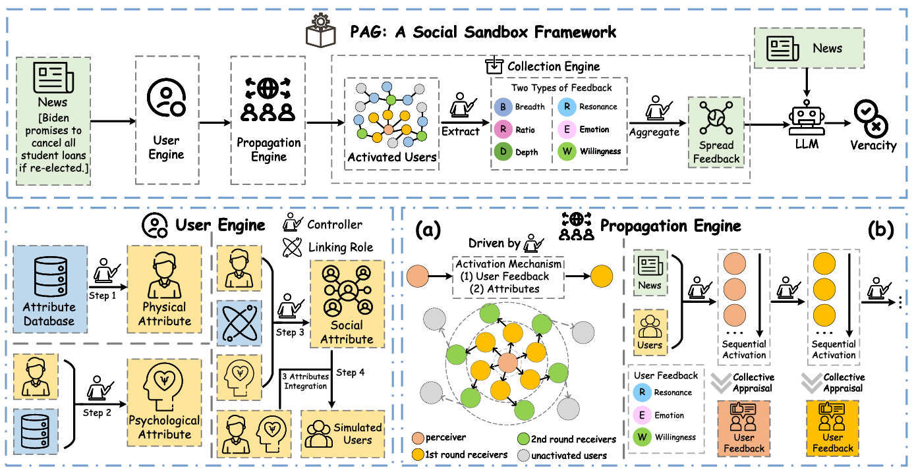

# Propagation-augmented generation: Debunk misinformation via social propagation simulation
🏆 Our paper has been accepted as a regular article at *Neurocomputing*!
## Abstract
The rapid spread of misinformation on social media threatens public trust and societal stability. While propagation patterns offer valuable cues for detection, existing models rely on sufficient real diffusion data, making early-stage debunking difficult. Recent simulation-based methods attempt to generate synthetic propagation paths but often depend on historical interactions or platform-specific structures. To address these limitations, we propose Propagation-Augmented Generation (PAG), a social simulation framework that virtually models news dissemination through LLM-driven multi-agent interaction, motivated by a critical question: can social propagation be virtually simulated purely from the news content itself to support early-stage misinformation detection? We introduce a modular Social Sandbox that employs a Large Language Model (LLM) as a “Controller” to execute a structured, simulation-as-reasoning task. This sandbox, composed of User, Propagation, and Collection Engines, generates virtual social signals directly from the source text, thereby eliminating the reliance on real-world propagation data, historical user interactions, or platform-specific structures. Experiments on four real-world datasets show that PAG consistently improves performance across various prompting paradigms and propagation-based methods, highlighting the potential of virtual social simulations for low-resource misinformation detection.
## Architecture

Overview of our proposed PAG framework for misinformation detection: User Engine, Propagation Engine, and Collection Engine. Specifically, (a) represents Gradual Activation Propagation of the Propagation Engine, while (b) refers to the Propagation Engine’s User Feedback component.
## Citation
If you find this work helpful, please consider citing our paper:
```bash
@article{Teng2026PAG,
author = "Jiasheng Si and Yeqing Teng and Xueguan Zhao and Xiaoming Wu and Wenpeng Lu and Deyu Zhou",
title = "{Propagation-Augmented Generation}: Debunk Misinformation via Social Propagation Simulation",
volume = "698",
pages = "1--15",
year = "2026",
journal = "Neurocomputing"
}
```
